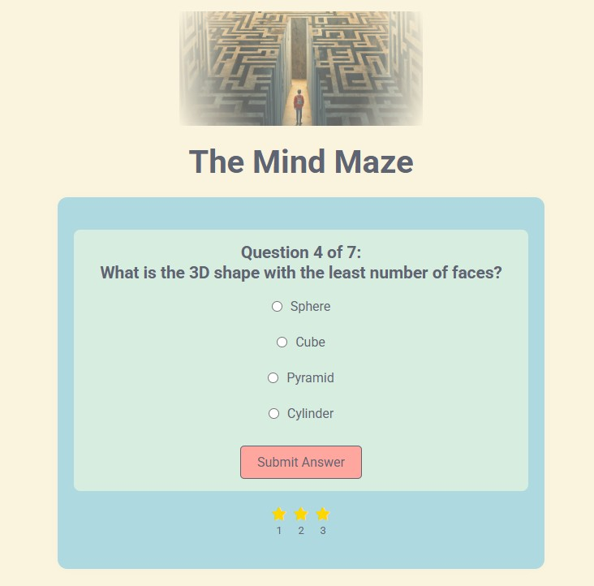

# The Mind Maze Quiz App

The Mind Maze is an interactive quiz application designed to test general knowledge in a fun and engaging way. Users can enter their name, answer multiple-choice questions, and receive instant feedback on their performance.

|  |
| ---------------------------------------------- |

## Features

- **Personalized Experience** – Users enter their name before starting the quiz.
- **Multiple-Choice Questions** – Each question offers several options with radio button selections.
- **Instant Feedback** – Correct and incorrect answers are visually represented and revealed via alerts.
- **Score Counter** – A "star" and "cross" token system tracks the user’s progress.
- **Responsive Design** – The layout adapts for optimal usability across different screen sizes.
- **Restart Option** – Users can restart the quiz to try again.

## How It Works

- Enter your name in the input field and press the Start Quiz button or hit "Enter" on your keyboard to proceed.
- Once you have familiarized yourself with instructions, read the question and select the correct answer using the radio buttons.
- Click "Submit Answer" to check if your answer is correct.
- Track your progress using the feedback counter.
- After all questions are answered, view your final score and restart if desired.

## Play this game

This app has been deployed on Netlify, so if you would like to try it out, click **[here](https://app.netlify.com/sites/times-tables-game-alex/overview)**.

## Technologies Used

- **HTML** – Structure of the quiz interface.
- **CSS** – Styling for an engaging user experience, including Caribbean sea-inspired colors.
- **JavaScript** – Handles quiz logic, user interactions, and local storage for name persistence.

## Future Enhancements

- Adding a timer for each question.
- Expanding the quiz with additional categories.
- Implementing a leaderboard for high scores.
